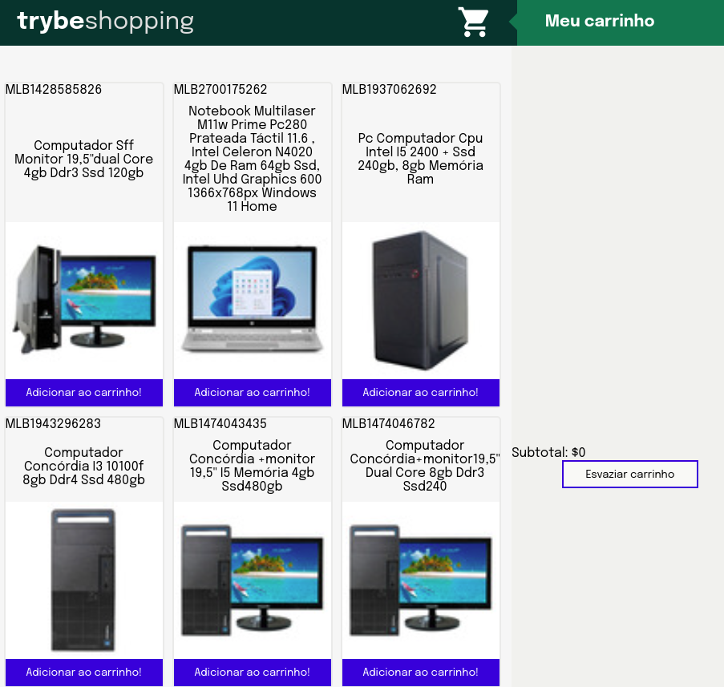

<!-- PROJECT LOGO -->
 

  

<h3 align="center">Shopping Cart Project</h3>

<!-- ABOUT THE PROJECT -->
## About The Project

 
  Esse é um projeto desenvolvido com Javascript vanilla em que construímos um site de ecommerce 
  a partir do consumo de uma API do Mercado Livre, onde desenvolvemos e utilizamos o Jest para testes, localStorage e HoF's.

<!-- CONTACT -->
## Contact

Alexandre Rocha - alexandre.e.rocha@gmail.com

Project Link: [https://shoppingcart-weld.vercel.app/](https://shoppingcart-weld.vercel.app/)
